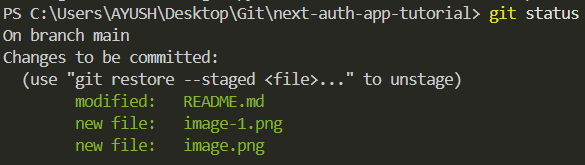
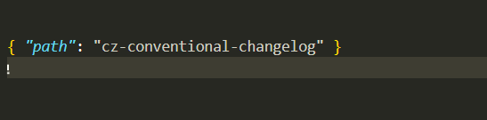
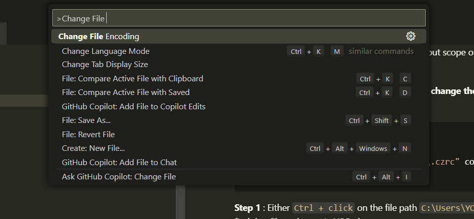
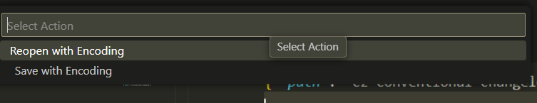
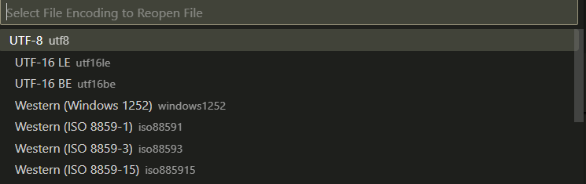
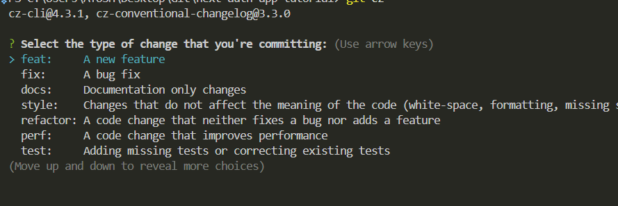

# CzCommits

### 1. Installation
Use Commitizen for structured commit messages.  
This guide installs the packages globally.    
Run the following commands in sequence. 

```powershell
npm install commitizen -g
npm install -g cz-conventional-changelog
echo '{ "path": "cz-conventional-changelog" }' >> ~/.czrc
```

### 2. Making Commits with Commitizen  

Once the package is installed make some changes in the project and add those changes using `git add .`.   



Commit these new changes by  running the follwing command : 

```
git cz 
```

You should be prompted with some questions about type and scope of the change, bug fix or a new feature. 


### 3. Fixing Encoding Issues

**In case of error of invalid charset you need to change the file encoding to expected type.**

:::danger invalid charset 
```> git cz```  
The config file at `"C:\Users\YOURNAME\.czrc"` contains an invalid charset. Expected UTF-8.
:::


#### **Step 1** :  Open the `.czrc` file in VSCode 

Either `Ctrl + click` on the file path `C:\Users\YOURNAME\.czrc` or find that file and open in VSCode.   
This is the file contents.   



#### **Step 2** : Change File encoding.

a . Press `Ctrl + Shift + P` and type `Change file encoding`.  
b.  Select `Reopen with Encoding`.   
c. Select the appropriate format, in our case it was `utf-8`.   










d.  Paste the data provided in the `.czrc` file. 

```json
{ "path": "cz-conventional-changelog" }
```

#### **Step 3** : Run Commitizen 

```
git cz
```

Expected behavior




All set!  
