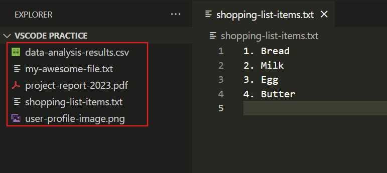
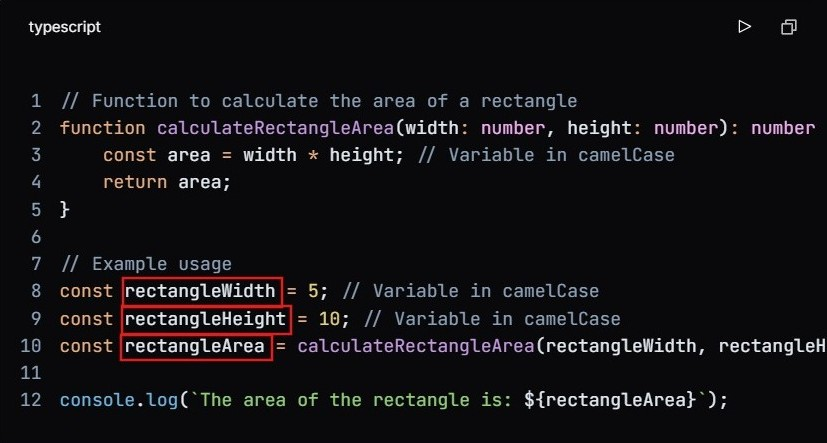

Welcome to our documentation! Here, you'll find important guidelines and best practices to ensure a smooth and successful experience while working on this project.

---

## ✅ Must Follow Guidelines

### 📂 File Naming Convention

- Use **kebab-case** for file names.
- In kebab case, words are separated by hyphens, and all letters are in lowercase.
- Example: `admin-login-form.tsx`

### 📝 Variable Naming Convention

- Use **camelCase** for variable names.
- In camel case, the first word is in lowercase, and each subsequent word starts with an uppercase letter, without spaces or underscores.
- Example: `const userName = "John Doe";`

### 🚀 Function Usage
- **Do not use arrow functions** for defining functions.
- Only use them for **inline functions**. Ex:
  ```tsx
  <form onSubmit={() => {}}> </form>
  ```

### ⚡ `useEffect` Restriction
- **Do not use `useEffect` for component mount synchronization.**
- Reference: [YouTube Link](https://www.youtube.com/watch?v=bGzanfKVFeU)

### 🔗 API Calls
- **Use TanStack Query** for API requests.
- ❌ Do not use `fetch` or `axios`. Always prefer TanStack Query.

### 🤖 AI Usage Restriction
- ❌ **Do not use AI-generated code.** Write everything manually for better control and quality.

### 🎨 UI Components
- Use **ShadCN components** for UI elements.
- **Do not** create custom components unless absolutely necessary.

### 🎨 Styling
- Use **Tailwind CSS** for styling.

### 🔄 Git Branching Strategy
We follow a structured branch naming convention:
1. `feature/your-feature-name` – For new features.
2. `fix/your-fix-name` – For bug fixes.
3. `refactor/your-refactor-name` – For code refactoring.
4. `hotfix/your-hotfix-name` – For critical fixes (**top priority**).

### 📝 Git Commit Messages
- Use **CZ Commitizen** for commit messages.

---

## 📌 Next.js 101
- Refer to the official **[Next.js Documentation](https://nextjs.org/docs)** for detailed information.

---

### 🚧 Limitations of React
- **SEO Issues** – Since React apps render content using JavaScript, search engines may struggle to index them properly, affecting visibility and potentially affecting search rankings.
- **Waterfall Problem** – React components often fetch data in a nested manner, where one request depends on another. This leads to multiple sequential API calls, increasing load time and slowing down performance.

### 🌍 Why is SEO Challenging in React?
- React primarily renders content on the **client side**, meaning search engines may not see fully loaded content when crawling the page.
- React’s single-page application (SPA) nature often leads to dynamically loaded pages **without proper URLs**, making it harder for search engines to track individual pages.
- Since React fetches data dynamically, important SEO elements like **meta tags and headings** may not be present in the initial HTML, affecting indexing.

### ⚡ Next.js Overview
- Next.js is a **framework** built on top of React that makes building websites easier and faster. It helps improve SEO and performance by allowing pages to load quickly with features like **server-side rendering (SSR)** and **static site generation (SSG)**. It also has built-in tools for handling images, routing, and fetching data, making development smoother and more efficient.

### 📌 Routing in Next.js


- Previously, Next.js used Pages Routing with the /pages directory. Later it introduced **App Routing** in version 13+, using the **`/app` directory** for a more flexible and powerful routing system. It leverages **React Server Components** by default, improving performance and SEO.  

#### 📌 **Basic Routing**  
In the `app/` directory, each folder represents a route, and the `page.js` file inside defines the page content.  
- `app/page.js` → `/` (Home Page)  
- `app/about/page.js` → `/about`  

#### 📌 **Dynamic Routing**  
Use square brackets `[ ]` to create dynamic routes.  
- `app/product/[id]/page.js` → Accessible as `/product/1`, `/product/2`, etc.  

#### 📌 **Nested Layouts & Shared UI**  
Layouts help structure pages efficiently.  
- `app/layout.js` applies a layout to all pages inside `app/`.  
- `app/dashboard/layout.js` → A layout specific to `/dashboard/*` pages.  

#### 📌 **API Routes in App Router**  
Instead of `pages/api/`, APIs are now created using `route.js` files.  
- `app/api/user/route.js` → Accessible at `/api/user`.  

#### 📌 **Loading & Error Handling**  
- `loading.js` → Shows a loading state while the page loads.  
- `error.js` → Handles page-specific errors gracefully.  

### 📂 Route Groups
Route Groups in Next.js help organize your project’s folder structure without affecting the URL. They are created by wrapping a folder name in parentheses ( ).
- Reference: [Next.js Documentation](https://nextjs.org/docs/app/building-your-application/routing/route-groups)


- Helps manage large projects with multiple sections (e.g., admin vs. public).
- Example: `app/(admin)/dashboard/page.tsx` does not include `(admin)` in the URL.

### 📌 Catch-All Segments
- Catch-all segments let you create one dynamic route that can handle multiple URL parts. This is useful when you don’t know how many segments a URL might have.  

# 🔗 How It Works  
- Use `[...slug]` inside the `app/` directory to capture **one or more** URL segments.  

# ✅ Example  
If you create this file:  
```bash  
app/blog/[...slug]/page.js  
```
It can match different URLs like:  
- `/blog/post-1` → `["post-1"]`  
- `/blog/category/post-2` → `["category", "post-2"]`   


### ⚡ Next.js 15 and `await` in Parameters
- In Next.js 15, route handlers support **`await` in parameters**, simplifying data fetching.
- Example:
  ```tsx
  export default async function Page({ params }: { params: { id: string } }) {
    const data = await fetchData(params.id);
    return <div>{data.title}</div>;
  }
  ```


